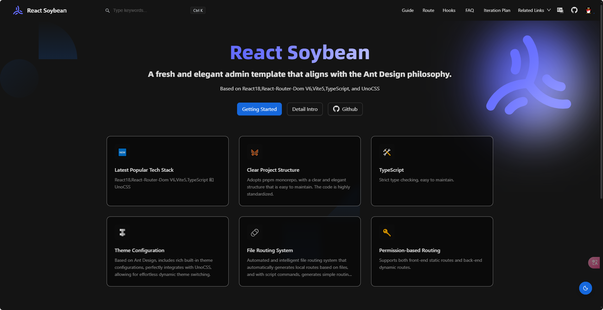

 
 <h1>SoybeanAdmin</h1>
  English | <a href="./README.zh_CN.md">中文</a>

> [!NOTE]
> If you think `React-Soybean-Admin` is helpful to you, or you like our project, please give us a ⭐️ on GitHub. Your support is the driving force for us to continue to improve and add new features! Thank you for your support!

## Introduction

A nanny-level documentation that aligns with the design philosophy of Ant Design

## License

This project is based on the [MIT © 2021 Soybean](./LICENSE) protocol, for learning purposes only, please retain the author's copyright information for commercial use, the author does not guarantee and is not responsible for the software.
