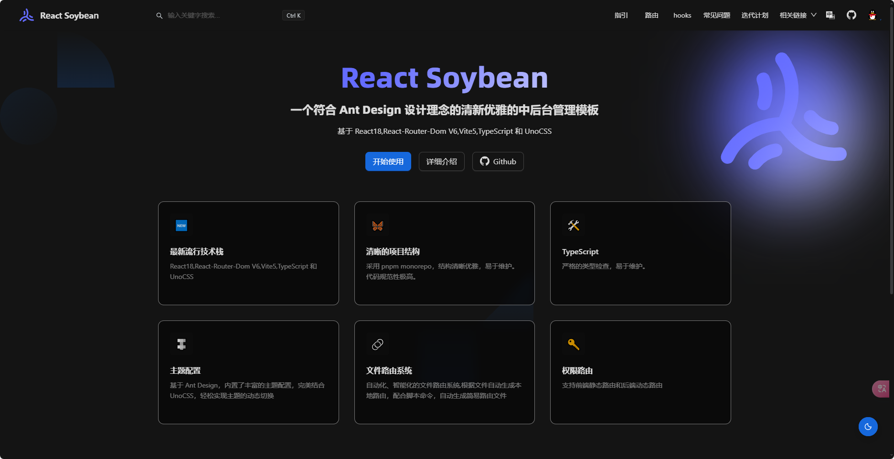

 
 <h1>SoybeanAdmin</h1>
  <a href="./README.md">English</a> | 中文

---

> [!NOTE]
> 如果您觉得 `SoybeanAdmin`对您有所帮助，或者您喜欢我们的项目，请在 GitHub 上给我们一个 ⭐️。您的支持是我们持续改进和增加新功能的动力！感谢您的支持！

## 简介

符合 Ant Design 风格的保姆级说明文档

## 开源协议

项目基于 [MIT © 2021 Soybean](./LICENSE) 协议，仅供学习参考，商业使用请保留作者版权信息，作者不保证也不承担任何软件的使用风险。
